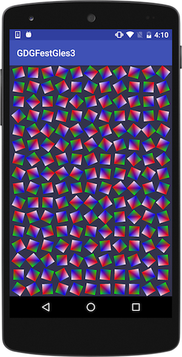

# Add Java code

We already created a `GLESJNILib` on the java side. Let's create another class `GLESJNIView` which extends `GLSurfaceView`

The skeleton code for class is as below.

```java

public class GLESJNIView extends GLSurfaceView {


    public  GLESJNIView(Context context) {

        super(context);

        // Pick an EGLConfig with RGB8 color, 16-bit depth, no stencil,
        // supporting OpenGL ES 2.0 or later backwards-compatible versions.
        setEGLConfigChooser(8, 8, 8, 0, 16, 0);
        setEGLContextClientVersion(2);
        setRenderer(new Renderer());
    }

    public static class Renderer implements GLSurfaceView.Renderer {

        @Override
        public void onSurfaceCreated(GL10 gl10, EGLConfig eglConfig) {
            
        }

        @Override
        public void onSurfaceChanged(GL10 gl10, int i, int i1) {

        }

        @Override
        public void onDrawFrame(GL10 gl10) {

        }
    }

}


```

Your task is to add corresponding native methods in `onSurfaceCreated`, `onSurfaceChanged` and `onDrawFrame`


Let's add this view to our `MainActivity.java`

```java
    GLESJNIView mGLView;
    
    .....
    
     mGLView = new GLESJNIView(this);

     setContentView(mGLView);

```

Click the Run button, you should see following in your target device.



In the [next](debugging_native_code.md) chapter learn about how to debug native code!