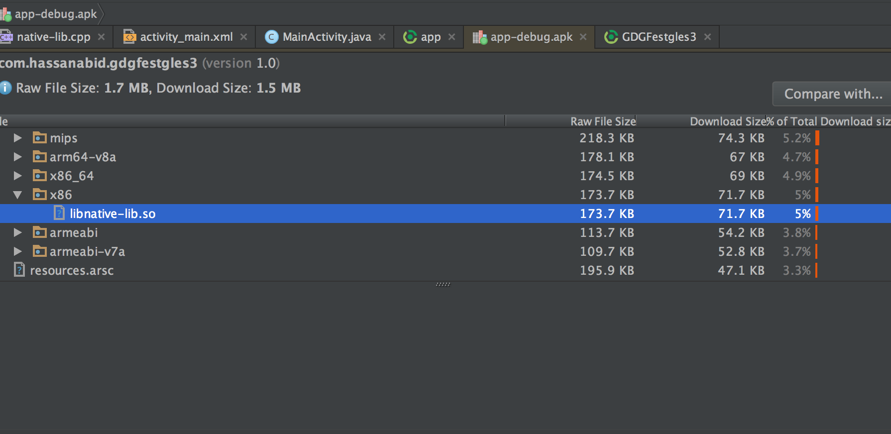

# Review Project

1- Android Studio created a sample `native-lib.cpp` file for us with `stringFromJNI` method.

```c++
#include <jni.h>
#include <string>

extern "C"
jstring
Java_com_hassanabid_gdgfestgles3_MainActivity_stringFromJNI(
        JNIEnv *env,
        jobject /* this */) {
    std::string hello = "Hello from C++";
    return env->NewStringUTF(hello.c_str());
}

```

The keyword `exern "C"` tells the compiler that this function can be used externally. For example in Java.

2- `CMake` command compiles `native-lib.cpp` into `libnative-lib.so`, which gradle then packages into APK as shown below. 

Select Build > Analyze APK.



Contents of `CMakeLists.txt are as follows`

```bash
cmake_minimum_required(VERSION 3.4.1)

# Creates and names a library, sets it as either STATIC
# or SHARED, and provides the relative paths to its source code.
# You can define multiple libraries, and CMake builds it for you.
# Gradle automatically packages shared libraries with your APK.

add_library( # Sets the name of the library.
             native-lib

             # Sets the library as a shared library.
             SHARED

             # Provides a relative path to your source file(s).
             # Associated headers in the same location as their source
             # file are automatically included.
             src/main/cpp/native-lib.cpp )

# Searches for a specified prebuilt library and stores the path as a
# variable. Because system libraries are included in the search path by
# default, you only need to specify the name of the public NDK library
# you want to add. CMake verifies that the library exists before
# completing its build.

find_library( # Sets the name of the path variable.
              log-lib

              # Specifies the name of the NDK library that
              # you want CMake to locate.
              log )

# Specifies libraries CMake should link to your target library. You
# can link multiple libraries, such as libraries you define in the
# build script, prebuilt third-party libraries, or system libraries.

target_link_libraries( # Specifies the target library.
                       native-lib

                       # Links the target library to the log library
                       # included in the NDK.
                       ${log-lib} )

```

Continue to next chapter for adding native code (openGL). 

